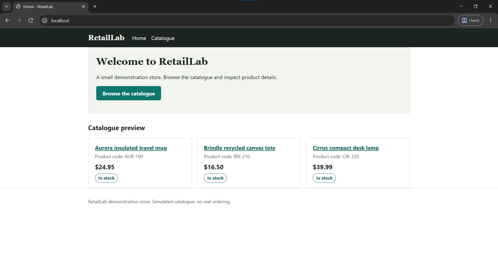
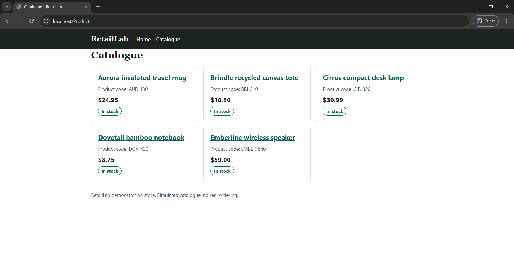
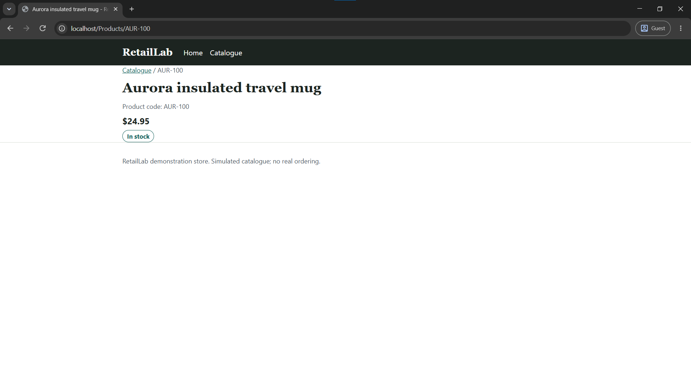

# RetailLab

RetailLab is a learning and portfolio project demonstrating the design and development of a small-business retail software solution in .NET. A persistent console workflow, a customer-facing website, and a local Windows staff application share one set of business rules over SQLite.

RetailLab is a demonstration and teaching codebase. It is not production-ready and not a SaaS product.

## Features

- **Persistent CLI retail workflow** — browse a seeded catalogue, bookmark products, place simulated multi-line orders, and review order history and remaining stock from the console.
- **Staff product and inventory management** — create products, update descriptions and prices, and archive or unarchive products instead of deleting them. SKUs are immutable after creation.
- **Inventory adjustment audit history** — every stock change is recorded with a signed quantity delta, a required reason, a UTC timestamp, and an actor identifier. Order lines record matching adjustments, so the full movement of stock is traceable.
- **Responsive Razor Pages catalogue** — a read-only website with a home page, a product catalogue, and product-details pages, styled with locally maintained CSS and no JavaScript framework.
- **Product details and availability** — prices formatted as USD with customer-friendly availability (`In stock`, `Low stock`, `Out of stock`) instead of exact inventory counts. Archived products are hidden from lists and return 404 when requested directly.

- **Customer accounts and favourites** — visitors register and sign in through framework-managed Identity with cookie sign-in (credentials live in framework-managed Identity tables, never in business tables). Each account keeps isolated favourites: anonymous pages show a "Sign in to save" link, signed-in customers get Add/Remove forms, and every change follows Post-Redirect-Get with friendly notices.

- **Customer basket** — signed-in customers add products from catalogue cards (one per click) or product pages (chosen quantity), then edit quantities and remove lines on the basket page, with line totals, a basket total, and availability bands. The basket reserves no inventory: out-of-stock products stay addable, archived lines stay visible but only removable, and a note explains that stock and prices are confirmed when ordering. Conflicting simultaneous changes show a friendly retry notice instead of an error page.

- **Simulated web checkout** — signed-in customers convert the basket into a simulated order with one atomic save (snapshot lines, stock reduction, audit entries, basket clearing), then view confirmation and order history. Duplicate submissions resolve to the original order, concurrent races retry with friendly notices, and every order surface states that no payment is processed.

- **Offline desktop inventory** — a WPF staff workspace lists exact local stock, including archived products, , records signed stock adjustments with a required reason through the same audited Core workflow used by the console, and opens a focused read-only window showing the selected product's complete adjustment history (newest first), including for archived products.

## Technology stack

| Area | Choice |
| --- | --- |
| Language / runtime | C# on .NET 10 |
| Web | ASP.NET Core Razor Pages |
| Data access | Entity Framework Core with SQLite |
| Desktop | WPF |
| Tests | xUnit |
| Version control | Git |

No JavaScript frameworks, cloud infrastructure, containers, or message brokers are used.

## Architecture

```text
Browser / Console / WPF
    |
    +-- RetailLab.Web (Razor Pages + display models) --+
    +-- RetailLab.LabCli (console menus) --------------+
    +-- RetailLab.Desktop (WPF staff workspace) -------+
                                                       v
                                              RetailLab.Core
                              (entities, rules, services, IRetailRepository)
                                                       |
                                              RetailLab.Data
                                    (EF Core mappings, repository,
                                     migrations, seed data)
                                                       v
                                                SQLite (.db file)
```

## Projects

| Project | Role |
| --- | --- |
| `src/RetailLab.Core` | Business entities (`Product`, `Order`, `Bookmark`, `BasketItem`, `InventoryAdjustment`), validation, and services (`OrderService`, `CheckoutService`, `ProductService`, `InventoryService`, `BookmarkService`, `BasketService`, `CatalogService`). Has no dependency on UI frameworks or Entity Framework Core. |
| `src/RetailLab.Data` | EF Core `DbContext`, entity mappings, the `EfRetailRepository` implementation, the standard Identity EF Core store (`AspNetUsers` and related framework tables), migrations, and idempotent seed data. |
| `src/RetailLab.LabCli` | Console application hosting the persistent retail workflow and the staff product/inventory workflow. |
| `src/RetailLab.Web` | Razor Pages storefront: catalogue plus Identity-backed customer accounts, per-customer favourites, a per-customer basket, and simulated checkout with order history. PageModels call Core services and render web-only display models; markup never touches entities. |
| `src/RetailLab.Desktop` | Windows WPF staff application: exact local inventory, audited stock adjustments, and read-only adjustment-history viewing. It coordinates existing Core services and keeps WPF display concerns outside the domain model. |
| `tests/RetailLab.Tests` | xUnit suite: Core unit tests, Web display tests, and SQLite integration tests. |

## Getting started

Prerequisite: [.NET 10 SDK](https://dotnet.microsoft.com/download).

```powershell
# Restore, build, and test (from the repository root)
dotnet build RetailLab.sln
dotnet test RetailLab.sln

# Run the console application
dotnet run --project src/RetailLab.LabCli

# Run the website, then open the printed http://localhost:XXXX URL in a browser
dotnet run --project src/RetailLab.Web

# Run the Windows staff application
dotnet run --project src/RetailLab.Desktop
```

## Demonstration database

The console, website, and desktop application use a local SQLite file. By default it lives at `%LOCALAPPDATA%\RetailLab\LabPrototype1\retaillab.db`. Set the `RETAILLAB_DATA_DIRECTORY` environment variable to point the applications at the same folder to deliberately share one demonstration database, or at a fresh empty folder for an isolated run (the schema migrates and the sample catalogue seeds automatically on startup). Runtime database files are git-ignored and must never be committed.

## Limitations

- Commerce is simulated: web and console checkout share one ordering implementation with no real payment processing.
- No staff login yet: the console and desktop use fixed demo actor labels; only web customers have real accounts so far.
- The desktop application adjusts stock and views adjustment history; product creation, editing, and archive controls remain in the console for now.
- No synchronization between installations.
- SQLite is a development and offline-demonstration choice, not a multi-user server database.

## Roadmap

Completed: persistent console retail flow, staff product and inventory management with audit history, the customer catalogue website, customer accounts with isolated favourites, a customer basket with simulated web checkout, , the first local WPF inventory-adjustment workflow, and desktop adjustment-history viewing. Planned next slices expand desktop staff workflows before desktop/server synchronization. Details live in [docs/ROADMAP.md](docs/ROADMAP.md); decisions are logged in [docs/DECISIONS.md](docs/DECISIONS.md).

## Testing

`dotnet test RetailLab.sln` — observed result: **137 tests, 0 failed** (Core unit tests, Web display and redirect-policy tests, and SQLite integration tests, including the shared local SQLite factory, migration, archive-visibility, audit-history, two-customer isolation, and standard Identity account coverage: hashing, sign-in, generic credential errors, and lockout; plus basket coverage: service rules, merge overflow, isolation, archived retention and removal, and deterministic persistence-conflict translation; plus checkout coverage: shared staging, current-price snapshots, isolation, idempotent duplicate submission, atomic rollback, final-unit and stale-data races, product-version conflicts, and order display).

## Screenshots





## Learning and engineering approach

RetailLab is built in small vertical slices: one working feature at a time, each backed by automated tests and an EF Core migration that preserves existing data. Business rules live in `Core`, storage details in `Data`, and presentation in the console and web projects, so each layer can be understood and reviewed independently. AI-assisted development is used for delivery speed, and every AI-produced change is human-reviewed, built, tested, and manually verified before it is kept.
